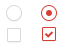

## 记录
原生的checkbox和radio的样式太简陋了，在设计页面的时候，设计师往往会设计自己的checkbox和radio样式。

原生的checkbox和radio改起来是不太好使，所以以下两个方法可以用来改变样式。

### 方法1(伪元素实现)
我们先用label标签绑定对应的checkbox和radio元素，然后将input标签的display设置为none

接着我们对label设置样式，让它模拟成具体的控件。比如checkbox，我们把label模拟成一个checkbox盒子，然后用伪元素添加钩钩。

比如

``` css
        #checkbox1:checked + label{
            border: 1px solid #d73d32;
        }
        #checkbox1:checked + label::after{
            content: '\2714';
            color: red;
            display: block;
            line-height: 20px;
            font-size: 10px;
            text-align: center;
        }
 
```

### 方法2(雪碧图实现)
同理，我们先把input的display设置成none

然后就是先把想要的图做成一个总体的png。然后给元素设置background。


比如：
截好png图




``` css
        .checkbox{
            width: 16px;
            height: 16px;
            background: url("bg.png") no-repeat;
            display: block;
        }
```

然后再checked和非checked状态下分别设置css：
``` css
        #checkbox1+label{
            background-position:  -6px -26px ;
        }
        #checkbox1:checked+label{
            background-position: -41px -26px;
        }

```

## 总结
雪碧图代码量少，更方便。伪元素方法可以全靠css实现，执行效率高，也不用加载图片，然后有局限性，代码高，且不如雪碧图还原。